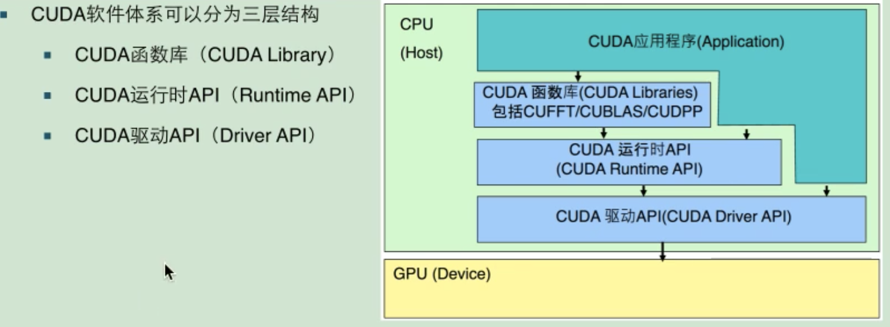

## CUDA

### ref

* http://www.icl.utk.edu/~mgates3/docs/cuda.html
* https://docs.nvidia.com/cuda/cuda-c-programming-guide/index.html

### 软件环境



* 驱动 API

基于句柄的底层接口，函数前缀皆为 `cu`。在调用驱动 API 前必须进行初始化，然后创建一个 CUDA 上下文，该上下文关联到特定设备并成为主机线程的当前上下文。

* 运行 API

没有专门的初始化函数，在第一次调用运行时函数自动进行初始化。使用运行时 API 通常需要包含 `cuda_runtime.h` ，函数前缀均为 `cuda`。

### 通信模式

#### 并行编程的通信模式

* 映射(map)

```
输入输出关系：一一对应(one-to-one)
example：每个元素倍数放大，y[i] = 3 * x[i]
```

* 聚合(gatter)

```
input/output: many-to-one
example: y[i] = (x[i-1] + x[i] + x[i+1]) / 3
```

* 分散(scatter)

```
input/output: one-to-many
```

* 模版(stencil)

```
以固定模式读取相邻的内存数值
input/output: serveral-to-one
```

* 转置(transpose)

```
input/output: one-to-one
```

* 压缩(reduce)

```
input/output: all-to-one
```

* 重排(scan/sort)

```
input/output: all-to-all
```

### 编程模型

CUDA 编程模型是一个异构模型，需要 CPU 和 GPU 协同工作。
* host：指代 cpu 及其内存
* device：指代 gpu 及其内存
CUDA 程序中既包括 host 程序又包括 device 程序，它们分别运行在 cpu 和 gpu 上。典型 CUDA 程序执行流程：
1. 分配 host 内存，进行数据初始化
2. 分配 device 内存，从 host 将数据拷贝至 device 上
3. 调用 CUDA 核函数在 device 上完成指定计算
4. 将 device 上的计算结果拷贝回 host
5. 释放 device 和 host 上分配的内存

kernel 是 CUDA 中的概念，是在 device 上线程中执行的函数，使用 `__global__` 关键字声明，调用时使用 `<<<grid, block>>>` 指定 kernel 要执行的线程数量，每个线程都要执行核函数，并且每个线程会分配一个唯一的线程号，这个线程号可通过核函数的内置变量 `threadIdx` 获取。

GPU 异构模型，在 CUDA 中通过函数类型限定词区分 host 和 device 上的代码：
* `__global__`：在 device 上执行，在 host 上调用，返回值为 void，不支持可变参数，不可作为类成员函数。使用 `__global__` 定义的 kernel 是异步的，即 host 不会等待其执行完成才执行下一步。
* `__device__`：在 device 上执行，仅在 device 上调用，不可和 `__global__` 同时使用。
* `__host__`：在 host 上执行，仅在 host 上调用，一般省略不写，不可和 `__global__` 同时使用，但可和 `__device__` 一起用，此时函数会在 device 和 host 上都编译。

一个 `kernel` 所启用的所有线程称为`网格(grid)`，`grid` 是线程结构的第一层次，而网格又可以分为很多`线程块(block)`，一个线程块中又包含很多线程，这是线程结构的第二层次。如下图所示：


grid 和 block 都是定义为 `dim3` 类型的变量：
```cpp
Components are accessible as variable.x,  variable.y,  variable.z,  variable.w. 
Constructor is make_<type>( x, ... ), for example:
float2 xx = make_float2( 1., 2. );
dim3 can take 1, 2, or 3 argumetns:
dim3 blocks1D( 5       );  // 缺省值为 1
dim3 blocks2D( 5, 5    );
dim3 blocks3D( 5, 5, 5 );
```

例如：
```cpp
dim3 grid(3, 2);
dim3 block(5, 3);
kernel_fun<<< grid, block >>>(prams...);
```

一个线程需要两个内置的坐标变量（blockIdx，threadIdx）来唯一标识，它们都是 dim3 类型变量，其中 blockIdx 指明线程所在 grid 中的位置，而 threaIdx 指明线程所在 block 中的位置，如图中的 Thread(1, 1)满足：
```cpp
threadIdx.x = 1
threadIdx.y = 1
blockIdx.x = 1
blockIdx.y = 1
```

CUDA 编程模型的原则：
1. 所有在同一个 block 上的线程必然在同一时间运行在同一个 SM 上；
2. 同一个内核的所有线程块必然会全部完成后，才会运行下一个内核。

一个线程块上的线程是放在同一个流式多处理器(SM)上的。要确定线程的全局 id 还需要如下内置变量：
```
dim3  gridDim  	dimensions of grid
dim3  blockDim 	dimensions of block
uint3 blockIdx 	block index within grid
uint3 threadIdx	thread index within block
int   warpSize 	number of threads in warp
```

下面例子为获取全局线程 id：
```cpp
// Kernel definition
__global__ void MatAdd(float A[N][N], float B[N][N],
float C[N][N])
{
    int i = blockIdx.x * blockDim.x + threadIdx.x;
    int j = blockIdx.y * blockDim.y + threadIdx.y;
    if (i < N && j < N)
        C[i][j] = A[i][j] + B[i][j];
}

int main()
{
    ...
    // Kernel invocation
    dim3 threadsPerBlock(16, 16);
    dim3 numBlocks(N / threadsPerBlock.x, N / threadsPerBlock.y);
    MatAdd<<<numBlocks, threadsPerBlock>>>(A, B, C);
    ...
}
```

CUDA 编程的最大特点：对线程块将在何处、何时运行不作保证。

优点：
* 硬件真正有效地运行
* 无需要线程间互相等待
* 可扩展性强

缺点：
* 对于哪个块在哪个 SM 上运行无法进行任何假设
* 无法获取块之间的明确通信
    * dead lock (并行死锁)
    * 线程退出

### 内存模型

每个线程有自己的私有本地内存(Local Memory)，而每个线程块有包含共享内存(Shared Memory)，可以被线程块中所有线程共享，其生命周期与线程块一致。此外，所有的线程都可以访问全局内存(Global Memory)。还可以访问一些只读内存块：常量内存(Constant Memory)和纹理内存(Texture Memory)。


内存速度比较：

`local memory > shared memory > global memory > host memory`

一个 kernel 实际上会启动很多线程，这些线程是逻辑上并行的，但是在物理层却并不一定。这其实和 CPU 的多线程有类似之处，多线程如果没有多核支持，在物理层也是无法实现并行的。但是好在 GPU 存在很多 CUDA 核心，充分利用 CUDA 核心可以充分发挥 GPU 的并行计算能力。GPU 硬件的一个核心组件是 SM，SM (Streaming Multiprocessor)，流式多处理器。SM 的核心组件包括 CUDA 核心，共享内存，寄存器等，SM 可以并发地执行数百个线程，并发能力就取决于 SM 所拥有的资源数。当一个 kernel 被执行时，它的 gird 中的线程块被分配到 SM 上，一个线程块只能在一个 SM 上被调度。SM 一般可以调度多个线程块，这要看 SM 本身的能力。那么有可能一个 kernel 的各个线程块被分配多个 SM，所以 grid 只是逻辑层，而 SM 才是执行的物理层。SM 采用的是 SIMT (Single-Instruction, Multiple-Thread，单指令多线程)架构，基本的执行单元是线程束(wraps)，线程束包含 32 个线程，这些线程同时执行相同的指令，但是每个线程都包含自己的指令地址计数器和寄存器状态，也有自己独立的执行路径。所以尽管线程束中的线程同时从同一程序地址执行，但是可能具有不同的行为，比如遇到了分支结构，一些线程可能进入这个分支，但是另外一些有可能不执行，它们只能死等，因为 GPU 规定线程束中所有线程在同一周期执行相同的指令，线程束分化会导致性能下降。当线程块被划分到某个 SM 上时，它将进一步划分为多个线程束，因为这才是 SM 的基本执行单元，但是一个 SM 同时并发的线程束数是有限的。这是因为资源限制，SM 要为每个线程块分配共享内存，而也要为每个线程束中的线程分配独立的寄存器。所以 SM 的配置会影响其所支持的线程块和线程束并发数量。总之，就是网格和线程块只是逻辑划分，一个 kernel 的所有线程其实在物理层是不一定同时并发的。所以 kernel 的 grid 和 block 的配置不同，性能会出现差异，这点是要特别注意的。还有，由于 SM 的基本执行单元是包含 32 个线程的线程束，所以 block 大小一般要设置为 32 的倍数。

#### 同步性和屏障

* 不同线程在共享和全局内存中读写数据需要有先后控制，所以引入同步概念；
* 屏障(barrier)作用：用来控制多个线程的停止和等待，当所有线程都到达屏障点，程序才继续进行。

### 程序示例

获取 GPU 属性
```cpp
#include <iostream>

using namespace std;

int main(int argc, char const *argv[]) {
    cudaDeviceProp prop;
 
    int count;
 
    // 获取 GPU 设备
    cudaGetDeviceCount(&count);
    cout << "GPU 数量: " << count << endl;
    for(unsigned i = 0; i < 1; ++i) {
        // 获取GPU属性信息
        cudaGetDeviceProperties(&prop, i);
        cout << "使用 GPU device: " << prop.name << endl;
        cout << "SM 数量: " << prop.multiProcessorCount << endl;
        cout << "totalGlobalMem: " << prop.totalGlobalMem / (1024.0 * 1024 * 1024) << " GB" << endl;
        cout << "每个线程块共享内存: " << prop.sharedMemPerBlock / 1024.0 << " KB" << endl;
        // cout << "regsPerBlock: " << prop.regsPerBlock << endl;
        // cout << "warpSize: " << prop.warpSize << endl;
        // cout << "memPitch: " << prop.memPitch << endl;
        // cout << "canMapHostMemory: " << prop.canMapHostMemory << endl;
        // cout << "pciDeviceID: " << prop.pciDeviceID << endl;
        // cout << "tccDriver: " << prop.tccDriver << endl;
        cout << "-----------------------------------------------"<< endl;
    }
    // 设置当前使用那块 GPU
    cudaSetDevice(count);
    return 0;
}
```